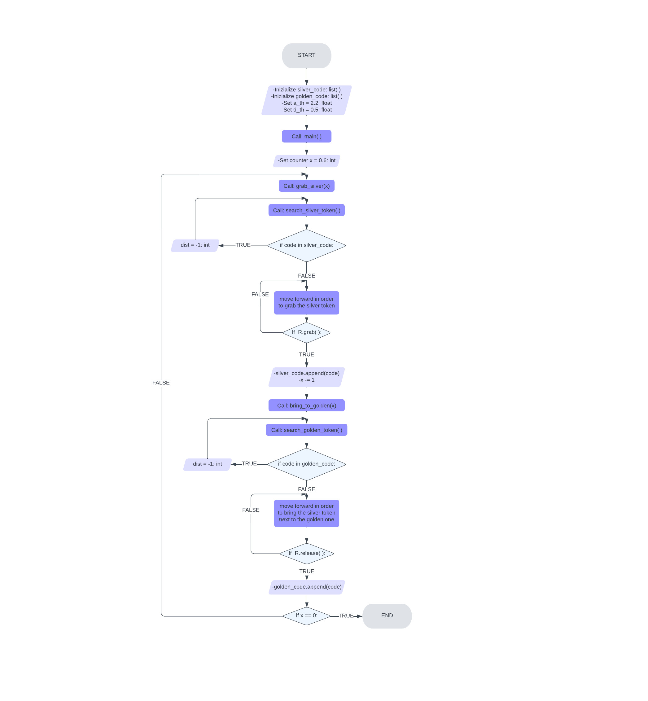

# Python Robotics Simulator

The aim of this project is to make a simulator for robotics. The simulator will be able to simulate a robot in a 2D environment and make it move around it and interact with objects. The robot will be able to sense the environment and use this information to make decisions. As far as the final result is concerned, the robot should try to place silver tokens next to goden ones, in order to distribute them in pairs.

## Installing

The simulator requires a Python 2.7 installation, the [pygame](http://pygame.org/) library, [PyPyBox2D](https://pypi.python.org/pypi/pypybox2d/2.1-r331), and [PyYAML](https://pypi.python.org/pypi/PyYAML/).

Pygame, unfortunately, can be tricky (though [not impossible](http://askubuntu.com/q/312767)) to install in virtual environments. If you are using `pip`, you might try `pip install hg+https://bitbucket.org/pygame/pygame`, or you could use your operating system's package manager. Windows users could use [Portable Python](http://portablepython.com/). PyPyBox2D and PyYAML are more forgiving, and should install just fine using `pip` or
`easy_install`.

---

## How to run the code

To run the program in the simulator, use `run.py`, passing it the file names.

```bash
$ python2 run.py assignment.py
```

It is neccesay to be in the folder that contain the program!

---

## Robot API

The API for controlling a simulated robot is designed to be as similar as possible to the [SR API][sr-api].

### Motors

The simulated robot has two motors configured for skid steering, connected to a two-output [Motor Board](https://studentrobotics.org/docs/kit/motor_board). The left motor is connected to output `0` and the right motor to output `1`.

The Motor Board API is identical to [that of the SR API](https://studentrobotics.org/docs/programming/sr/motors/), except that motor boards cannot be addressed by serial number. So, to turn on the spot at one quarter of full power, one might write the following:

```python
R.motors[0].m0.power = 25
R.motors[0].m1.power = -25
```

### The Grabber

The robot is equipped with a grabber, capable of picking up a token which is in front of the robot and within 0.4 metres of the robot's centre. To pick up a token, call the `R.grab` method:

```python
success = R.grab()
```

The `R.grab` function returns `True` if a token was successfully picked up, or `False` otherwise. If the robot is already holding a token, it will throw an `AlreadyHoldingSomethingException`.

To drop the token, call the `R.release` method.

Cable-tie flails are not implemented.

### Vision

To help the robot find tokens and navigate, each token has markers stuck to it, as does each wall. The `R.see` method returns a list of all the markers the robot can see, as `Marker` objects. The robot can only see markers which it is facing towards.

Each `Marker` object has the following attributes:

- `info`: a `MarkerInfo` object describing the marker itself. Has the following attributes:
  - `code`: the numeric code of the marker.
  - `marker_type`: the type of object the marker is attached to (either `MARKER_TOKEN_GOLD`, `MARKER_TOKEN_SILVER` or `MARKER_ARENA`).
  - `offset`: offset of the numeric code of the marker from the lowest numbered marker of its type. For example, token number 3 has the code 43, but offset 3.
  - `size`: the size that the marker would be in the real game, for compatibility with the SR API.
- `centre`: the location of the marker in polar coordinates, as a `PolarCoord` object. Has the following attributes:
  - `length`: the distance from the centre of the robot to the object (in metres).
  - `rot_y`: rotation about the Y axis in degrees.
- `dist`: an alias for `centre.length`
- `res`: the value of the `res` parameter of `R.see`, for compatibility with the SR API.
- `rot_y`: an alias for `centre.rot_y`
- `timestamp`: the time at which the marker was seen (when `R.see` was called).

For example, the following code lists all of the markers the robot can see:

```python
markers = R.see()
print "I can see", len(markers), "markers:"

for m in markers:
    if m.info.marker_type in (MARKER_TOKEN_GOLD, MARKER_TOKEN_SILVER):
        print " - Token {0} is {1} metres away".format( m.info.offset, m.dist )
    elif m.info.marker_type == MARKER_ARENA:
        print " - Arena marker {0} is {1} metres away".format( m.info.offset, m.dist )
```

---

## Main of the Program and Functions

Execpt main function, `main()`, the program contains four leading functions which allow our robot to complete all of its tasks:

1. `grab_silver(x)`
2. `bring_to_golden(x)`
3. `search_silver_token()`
4. `search_golden_token()`

### Declare global variables

First of all, we have to declare all the variables we need for our program.

- Inizialize lists that will contain tokens' codes:
  1. `silver_code` = [ ]
  2. `golden_code` = [ ]
- Set the parameters:
  1. `a_th` = 2.2
  2. `d_th` = 0.5

### Main function

The main function, `main()`, is quite simple.
In it we pass two things: the number of silver and golden pairs (in our case is equal to six, `x = 6`), in order to make the robot complete all of its tasks, and a function call, `grab_silver(x)` , in which we pass the previous number.

In fact, the main function, `main()`, has the following structure:

```python
def main():
  x = 6
  grab_silver(x)
```

This function is called in the main of the program, in order to start what the program should do.

### grab_silver()

The function `grab_silver(x)` is the only one which is called inside main function,`main()`.
Through an infinite loop while, what the function should do is:

1. Take as parameters the distance, the rotation and the code relative to the nearest silver token in its line of sight by the function call, `search_silver_code()`.

2. Check if the silver token's code is inside `silver_code` list and assign -1 to the distance if it is contained, in order to make the robot turn round itself to find other silver one.

3. If the code is not in `silver_code` list, we proceed to get the silver token by some conditional statements.

4. Once we arrive near to the silver token we make the robot grab it, mark the relative token's code inside `silver_code` list, turn it round itself and finally we call a function, `bring_to_golden(x)`, in order to bring the silver token next to a golden one.

### bring_to_golden(x)

This function is called inside `grab_silver(x)` function once the robot has grabbed a silver token.

This function in quite similat to the previous function, in fact through an infinite loop while the function should do:

1. Take as parameters the distance, the rotation and the code relative to the nearest silver token in its line of sight by the function call, `search_golden_code()`.

2. Check if the golden token's code is inside `golden_code` list and assign -1 to the distance if it is contained, in order to make the robot turn round itself to find other golden one.

3. If the code is not in `golden_code` list, we proceed to bring the silver token next to a golden one by some conditional statements.

4. Once we arrive near to the golden token we make the robot release the silver one, mark the relative golden token's code inside `golden_code` list, move backward for a while, turn it round itself and finally we call `grab_silver(x)`, in order to grab another silver token.

The only way to make the program end is by a conditional statement, inside this function, in which we check the value of x.
If the value of x is equal to 0, it means that the robot has completed all of its tasks and so the program ends.

The folowing code represents how the program can end:

```python
if x = 0:
    print('well job')
    exit()
```

### search_silver_token() and search_golden_token()

These two functions are called respectively inside `grab_silver(x)` and `bring_to_golden(x)` functions, in order to get the nearest token in its line of sight with its corresponding parametres.

Both functions return three values:

1. `dist`, which is the distance relative to the nearest token;
2. `rot_y`, which is the angle of rotation netween the robot and the token;
3. `code`, which is the token's unique identfication code.

If no tokens is detected the function return -1 to all the values.

---

## Flowchart

Here is the flowchart of the program:


---

## Future Implementation

As far as future implementetion are concerned, the program could be improved in these ways:

- In order to increase the time efficiency, we could make the robot grab the nearest silver token in general, not only in its line of sight, and bring it next to the nearest golden one, also not only in its line of sight.

This can be done by creating a function that makes the robot turn round itself and in the meantime mark all tokens' codes with their relative distance inside a list. Once the robot ends its turn, we check which is the shortest distance so we will be able to grab/bring the corresponding token.

Another way to solve this problem is by increasing the robot's line of sight in order to get the robot a 360-degree view.

[sr-api]: https://studentrobotics.org/docs/programming/sr/
